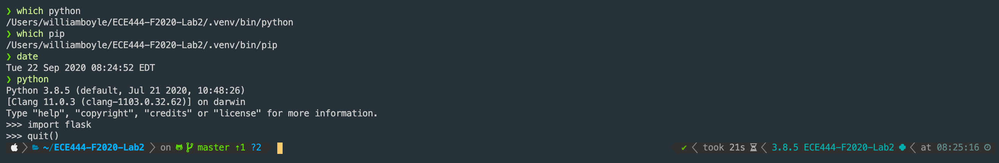
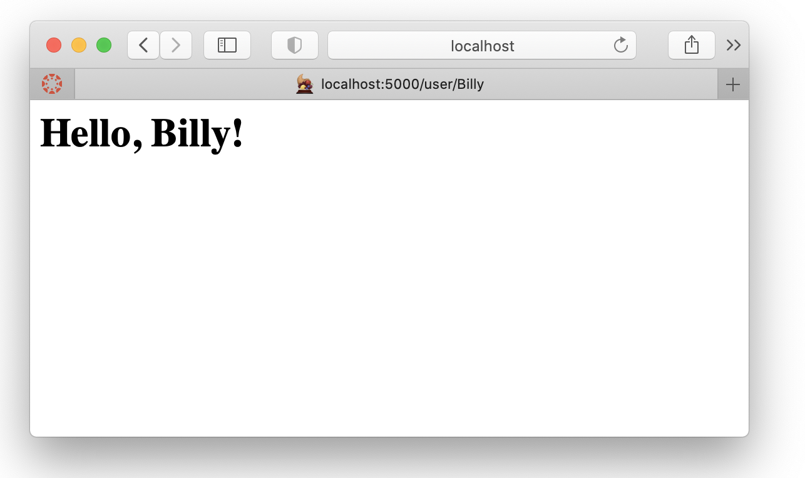

# ECE444 Lab 2

## William Boyle

This repo is a clone of [Flasky](https://github.com/miguelgrinberg/flasky)

## Activity 1
Installation

## Activity 2
Creating a repo and replay textbook

## Activity 3
Briefly summarize what are Flask context globals

There are two context globals. The Application Context keeps track of application-level data during a request. Rather than passing the application to each function the ``current_app`` and ``g`` proxies are used. The Request Context keeps track of the request-level data during a request. Instead of passing the request object to functions the ``request`` and ``session`` proxies are used.